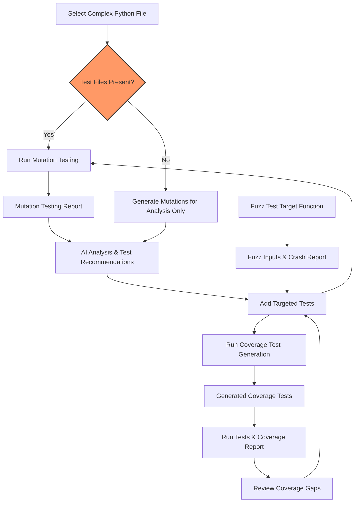

# Testing Advanced Real-World Python Projects

Explore practical usage of the Python Testing Tools MCP Server for complex, real-world Python codebases. This guide focuses on applying the full power of the server's AI-driven testing tools—covering multi-threading, stateful processors, and security analytics—showing how to leverage mutation testing, coverage-driven test generation, and fuzz testing in sophisticated scenarios.

---

## 1. Workflow Overview

**Objective:**
Empower developers and testers to efficiently apply the Python Testing Tools MCP Server on advanced Python projects exhibiting multithreading, intricate state management, and security-focused logic.

**Prerequisites:**
- Python Testing Tools MCP Server installed and configured with Gemini API key
- Python source files exhibiting complex patterns (e.g., concurrency, stateful processors, security validations)
- Basic understanding of mutation testing, fuzz testing, and coverage testing concepts

**Expected Outcome:**
- Generate, run, and interpret mutation testing results on sophisticated code
- Create targeted coverage-driven test suites that exercise deep code paths
- Perform fuzz testing focusing on edge and failure scenarios in complex functions
- Understand AI-generated analysis and test recommendations to close coverage gaps

**Time Estimate:** 30-60 minutes per codebase depending on complexity and mutation limits

**Difficulty Level:** Intermediate to Advanced

---

## 2. Applying Mutation Testing on Complex Python Code

Mutation testing is a key AI-powered capability for evaluating how well your tests catch subtle bugs, especially important in advanced systems with concurrency and security considerations.

### Step 1: Prepare the Target Code

- Identify the Python file implementing complex logic—e.g., `demo/data_processor.py` (multi-threaded processing) or `demo/security_analyzer.py` (security validation).
- Ensure any existing test files are present under standard naming conventions (e.g., `test_data_processor.py`).

### Step 2: Run Mutation Testing

Use the MCP command or call the tool function:

```bash
run mutation testing on demo/data_processor.py
```

Or via programmatic call:

```python
from tools.mutation_tester import run_mutation_testing
report = run_mutation_testing('demo/data_processor.py')
print(report)
```

### Step 3: Interpret Results

- Review the mutation testing report detailing:
  - Mutation score (% mutations killed by tests)
  - Number and types of survived mutations
  - AI-driven analysis highlighting critical survived mutations
  - Recommended concrete test cases to add

- Prioritize adding tests for mutations labeled as **critical survivors**, often involving concurrency control, error handling, or security checks.

### Step 4: Implement AI-Suggested Tests

- Use AI-provided recommendations as concrete test recipes, including inputs, expected outputs, and assertion logic.
- Add new tests to existing test files or create new ones.

### Step 5: Re-run Mutation Testing

- Validate improvements in test quality and mutation score.
- Iteratively refine tests targeting edge cases revealed by mutation analysis.

---

## 3. Generating Coverage-Driven Tests for Stateful and Multi-threaded Code

Maximize coverage on intricate code areas such as multi-threaded operations and state machines using the coverage tester.

### Step 1: Run Coverage Test Generation

Command:

```bash
generate coverage tests for demo/data_processor.py
```

Or in code:

```python
from tools.coverage_tester import generate_coverage_tests
coverage_report = generate_coverage_tests('demo/data_processor.py')
print(coverage_report)
```

### Step 2: Understand Coverage Targets

- The tool detects and targets all branches, loops, exception paths, and returns.
- For concurrency, tests cover thread state transitions including races and synchronization blocks.
- Security-related validation paths are tested for all conditionals and error branches.

### Step 3: Review and Execute Generated Tests

- Inspect generated tests for completeness, coverage, and meaningful edge cases.
- Execute tests using your preferred Python test runner.

### Step 4: Use Coverage Reports

- Leverage integrated coverage.py reports to identify uncovered paths.
- Refine tests or add new ones for uncovered edge cases or error conditions.

---

## 4. Fuzz Testing Complex Functions with AI-Generated Inputs

Fuzz testing complements mutation and coverage testing by exposing functions to unexpected, boundary, and malformed inputs.

### Step 1: Select Function to Fuzz

Choose a function critical to your project’s robustness, e.g., `binary_search_with_analytics` in `demo/advanced_algorithms.py`.

### Step 2: Run Fuzz Tester Tool

Command:

```bash
fuzz test the binary_search_with_analytics function in demo/advanced_algorithms.py
```

Programmatically:

```python
from tools.fuzz_tester import fuzz_test_function
fuzz_results = fuzz_test_function('demo/advanced_algorithms.py', 'binary_search_with_analytics')
print(fuzz_results)
```

### Step 3: Analyze Fuzzing Outcomes

- Review crashes, exceptions, or unexpected behavior.
- Identify input patterns causing failures for hardened test creation.

### Step 4: Write Defensive Tests

- Use fuzzing insights to add negative tests checking error handling.
- Ensure edge cases lead to graceful failure or correct exceptions rather than silent errors.

---

## 5. Best Practices & Tips for Advanced Real-World Testing

- **Start Small, Then Scale:** Begin mutation testing with a limited max mutations to quickly identify major gaps before scaling.
- **Prioritize Critical Mutations:** Focus on mutations involving concurrency controls, error handling, boundary checks, and security validation.
- **Leverage AI Analysis:** Use the AI-powered mutation intelligence from `utils/mutation_intelligence.py` to guide targeted test improvements.
- **Combine Coverage & Mutation Results:** Use coverage-driven tests to fill structural gaps; use mutation testing to refine effectiveness.
- **Iterate Gradually:** Repeatedly run tests and analyses after incremental test additions to maximize coverage and robustness.
- **Maintain Test Stability:** For multi-threaded code, stabilize tests using mocks, synchronization barriers, or deterministic schedules.
- **Review AI Recommendations Critically:** AI suggestions may need adjustment for project-specific logic or performance considerations.

---

## 6. Troubleshooting Common Challenges

<AccordionGroup title="Troubleshooting & Tips">
<Accordion title="No Test Files Found, Only Mutation Analysis Available">
If no test files are detected, the tool generates mutations but cannot run them.

**Solution:** Start writing base tests manually or generate unit tests with the `generate_unit_tests_tool` before running mutation testing.
</Accordion>
<Accordion title="Test Execution Timeouts in Mutation Testing">
Mutation testing runs tests repeatedly; timeouts may occur.

**Solution:** Simplify or parallelize tests, or increase timeout limits in test commands.
</Accordion>
<Accordion title="Handling Flaky Multi-threaded Tests">
Concurrency may cause test flakiness.

**Solution:** Add synchronization hooks or isolate flaky tests; consider mocking external dependencies.
</Accordion>
<Accordion title="Coverage Gaps in Complex Logic">
Sometimes coverage reports show gaps despite tests.

**Solution:** Manually explore uncovered paths; generate additional coverage tests using the coverage tool with focus on missing branches.
</Accordion>
<Accordion title="AI Analysis Reports Parsing Errors">
Rare parsing failures can occur.

**Solution:** Check log outputs for raw AI responses; update MCP server or retry with smaller mutation sets.
</Accordion>
</AccordionGroup>

---

## 7. Examples

### Example: Running Mutation Testing on Stateful Processor

```bash
run mutation testing on demo/data_processor.py
```

**Expected outcome:**
- Mutation testing report showing survived mutation examples around state changes
- AI suggestions to add tests around race conditions or error recovery paths

### Example: Generating Coverage Tests for Security Analyzer

```bash
generate coverage tests for demo/security_analyzer.py
```

**Expected outcome:**
- Tests covering all validation routines, exception raises, and fallback handling
- Integration with coverage.py for detailed path coverage

### Example: Fuzz Testing a Complex Sorting Algorithm

```bash
fuzz test the quick_sort_with_metrics function in demo/advanced_algorithms.py
```

**Expected outcome:**
- Diverse inputs including large arrays, empty arrays, and edge conditions
- Identification of potential input-triggered failures

---

## 8. Next Steps & Related Content

- For foundational setup, see [System Requirements & Prerequisites](../getting-started/setup-prerequisites-installation/system-requirements).
- Start with [Running Your First Intelligent Python Tests](../guides/getting-started/first-tests) to get a baseline.
- Deep dive into mutation testing with the [Guide to Mutation Testing](../guides/core-workflows/guide-mutation-testing).
- Learn advanced coverage test generation here: [Coverage Testing Guide](../guides/core-workflows/guide-coverage-testing).
- Integrate these tools into CI/CD with [CI/CD Integration](../guides/advanced-usage/integration-ci).

---

## 9. Diagram: Advanced Testing Workflow Overview



---