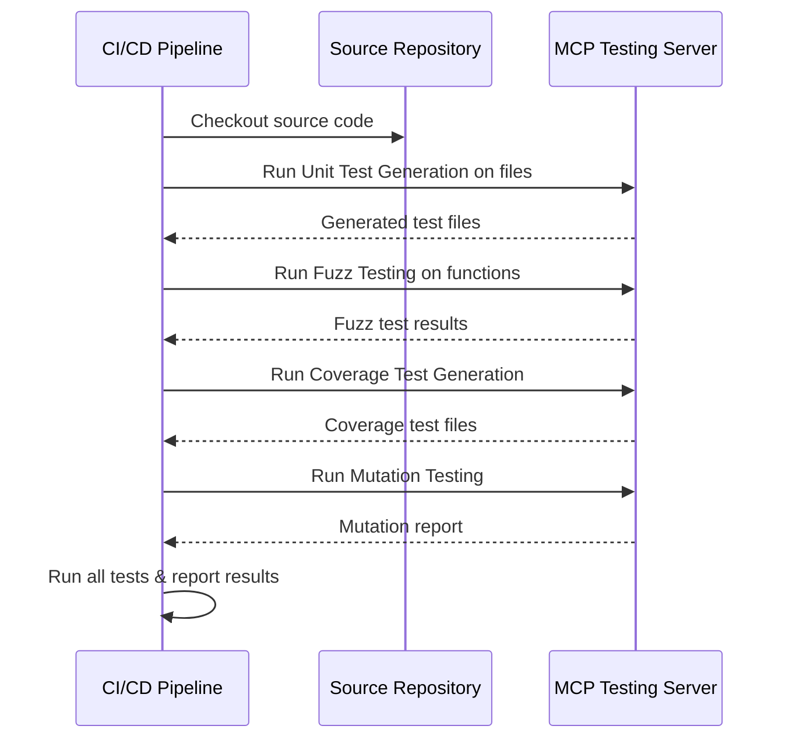
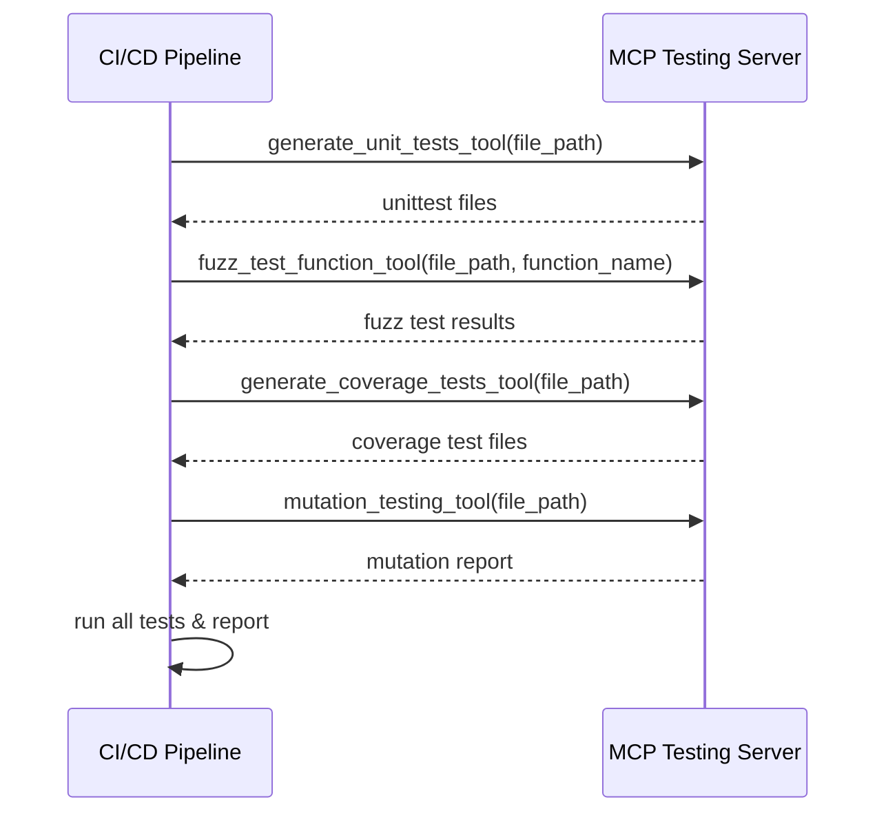

# Integrating MCP Testing Tools with CI/CD Pipelines

---

## Overview

This guide provides practical, step-by-step instructions for integrating the Python Testing Tools MCP Server's AI-powered testing capabilities into your CI/CD pipelines. You'll learn how to automate unit test generation, fuzz testing, coverage-driven test creation, and mutation analysis within your build workflows. The guide covers recommended integration patterns, error handling best practices, and tips for maximizing reliability and efficiency in continuous integration environments.

---

## 1. Understanding Integration Goals

Leveraging MCP Testing Tools in CI/CD pipelines enables your team to continuously enhance the quality and robustness of Python codebases by:

- Automatically generating or updating unit tests whenever code changes
- Running AI-driven fuzz tests to detect edge case failures early
- Creating comprehensive coverage tests to maximize code path verification
- Performing mutation testing to evaluate and improve test suite effectiveness

These automated steps help catch issues faster, improve test coverage, and reduce manual test creation overhead.

---

## 2. Prerequisites

Before integrating MCP Testing Tools into your CI/CD pipeline, ensure:

- **MCP Server is Installed and Running:** Follow installation and startup guides to have the server operational.
- **Environment Variables Set:** `GEMINI_API_KEY` and optional settings are correctly configured in your CI environment.
- **Network Access:** Your CI environment can communicate with the MCP server endpoint.
- **Project Source Code Available:** Python source files are checked out and accessible during builds.
- **CI Pipeline Has Python Environment:** Python 3.8+ and required dependencies are installed in your build agents.

---

## 3. Integration Patterns

### 3.1 Triggering AI-Powered Testing as Build Steps

Incorporate MCP Testing Tools as discrete steps or jobs within your pipeline configuration—for instance, in GitHub Actions, GitLab CI, Jenkins, or CircleCI.

Each testing tool corresponds to a specific CLI command or script invocation that you should run with appropriate file and function arguments.

### 3.2 Recommended Pipeline Step Flow



This flow ensures AI tools augment your existing test process and outputs.

### 3.3 Source Control Integration

- Commit or stash generated test files in branches or as artifacts, depending on your workflow.
- Consider regenerating tests only on significant code changes for efficiency.

---

## 4. Running MCP Testing Tools in CI

Below are actionable commands and code snippets to run the main MCP tools during pipeline execution. Adjust paths and arguments to suit your repository structure.

### 4.1 Unit Test Generation

Automatically generate or refresh unit tests for a given Python module.

```bash
uv run python python_testing_mcp_server.py generate_unit_tests_tool --file_path=path/to/your_module.py
```

- Output: Path to the generated unittest file.
- Use this output to commit updated tests or run them locally.

### 4.2 Fuzz Testing

Perform intelligent fuzz tests on a specified function.

```bash
uv run python python_testing_mcp_server.py fuzz_test_function_tool --file_path=path/to/your_module.py --function_name=your_function
```

- Output: Summary of fuzz test execution including crash discoveries.

### 4.3 Coverage Test Generation

Create test cases that aim to maximize branch, loop, exception, and path coverage.

```bash
uv run python python_testing_mcp_server.py generate_coverage_tests_tool --file_path=path/to/your_module.py
```

- Output: Path to coverage-focused test file.

### 4.4 Mutation Testing

Run mutation analysis to detect gaps in existing tests.

```bash
uv run python python_testing_mcp_server.py mutation_testing_tool --file_path=path/to/your_module.py
```

- Output: Detailed mutation testing report including mutation score and AI recommendations.

---

## 5. Best Practices & Tips

### 5.1 Environment Stability

- Ensure stable network connectivity between CI agents and MCP server; retry failed requests where reasonable.
- Securely store and inject API keys and secrets in pipeline environment variables.

### 5.2 Workflow Efficiency

- Cache dependencies and MCP-generated test artifacts between builds.
- Use conditional execution to avoid generating tests unnecessarily (e.g., only when source code changes).
- Parallelize test generation and mutation analysis across multiple jobs if supported by your CI.

### 5.3 Error Handling

- Capture and output detailed logs on MCP tool failures for faster troubleshooting.
- Consider fallback mechanisms to skip AI steps temporarily if API limits or connectivity issues arise.

### 5.4 Test Artifacts Management

- Define clear policies for committing AI-generated test code to source control.
- Use artifacts or external storage for ephemeral test files to avoid polluting main branches.

---

## 6. Troubleshooting Common Issues

| Problem                            | Cause                         | Solution                                                      |
|----------------------------------|-------------------------------|---------------------------------------------------------------|
| API key not found or invalid     | Missing or misconfigured GEMINI_API_KEY | Validate variable is set in CI; double-check casing and scope |
| Network timeout or connectivity  | Firewall or proxy blocking     | Ensure MCP server endpoint accessible; configure proxies       |
| AI tool returns empty or error   | Server issues or invalid inputs| Review logs; check file path and arguments correctness          |
| Test files not generated or ignored| File permissions or pipeline caching| Ensure write permissions and output folders configured correctly|
| Mutation testing slow or incomplete| Large codebase or resources   | Optimize pipeline resources; run mutation analysis selectively  |

---

## 7. Example GitHub Actions Workflow Snippet

```yaml
name: Python Testing MCP Pipeline

on:
  push:
    branches: [main, develop]

jobs:
  ai-tests:
    runs-on: ubuntu-latest
    env:
      GEMINI_API_KEY: ${{ secrets.GEMINI_API_KEY }}

    steps:
      - name: Checkout code
        uses: actions/checkout@v3

      - name: Setup Python
        uses: actions/setup-python@v4
        with:
          python-version: '3.10'

      - name: Install dependencies
        run: |
          python -m pip install --upgrade pip
          pip install uv

      - name: Run Unit Test Generation
        run: |
          uv run python python_testing_mcp_server.py generate_unit_tests_tool --file_path=src/module.py

      - name: Run Fuzz Testing
        run: |
          uv run python python_testing_mcp_server.py fuzz_test_function_tool --file_path=src/module.py --function_name=target_function

      - name: Run Coverage Test Generation
        run: |
          uv run python python_testing_mcp_server.py generate_coverage_tests_tool --file_path=src/module.py

      - name: Run Mutation Testing
        run: |
          uv run python python_testing_mcp_server.py mutation_testing_tool --file_path=src/module.py

      - name: Run Tests
        run: |
          python -m unittest discover
```

---

## 8. Next Steps & Further Resources

- Integrate generated tests into your main test suites and CI test runs.
- Automate feedback to PRs with mutation scores and fuzz test results.
- Explore related documentation:
  - [Core Testing Workflows](../core-workflows/guide-unit-testing)
  - [Running Your First Intelligent Python Tests](../../getting-started/first-run-usage-validation/first-successful-validation)
  - [Configuration & API Key Setup](../../getting-started/setup-prerequisites-installation/configuration-setup)
- Join the community for support and updates: [BoundaryML Discord](https://boundaryml.com/discord)

---

## Summary Diagram



---

<Tip>
Integrating MCP Testing Tools enables continuous AI-driven quality improvements, helping your team catch bugs and gaps early while accelerating safe delivery of Python software.
</Tip>

---

# Related Documentation

- [System Architecture & Main Components](/overview/product-intro-and-architecture/core-architecture-overview)
- [Core Features at a Glance](/overview/concepts-features-usecases/core-features-overview)
- [Installation and Initial Setup](/guides/getting-started/installation-setup)
- [Running Your First Intelligent Python Tests](/guides/getting-started/first-tests)
- [Automating Python Unit Test Generation](/guides/core-workflows/guide-unit-testing)
- [Fuzz Testing Functions with AI-Generated Inputs](/guides/core-workflows/guide-fuzz-testing)
- [Generating Comprehensive Coverage-Driven Test Suites](/guides/core-workflows/guide-coverage-testing)
- [Applying Mutation Testing for Test Quality Analysis](/guides/core-workflows/guide-mutation-testing)


---

For detailed code examples, setup instructions, and troubleshooting, visit the project repository: [https://github.com/jazzberry-ai/python-testing-mcp](https://github.com/jazzberry-ai/python-testing-mcp)

---

## Feedback

If you encounter issues or want support for specific CI systems, please consult the community channels or GitHub Discussions for assistance.


