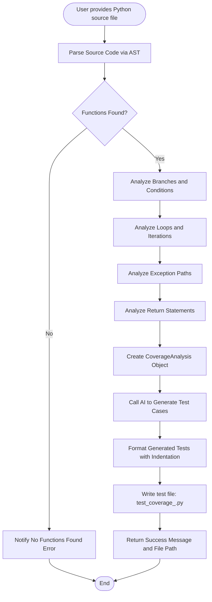

# Generating Comprehensive Coverage-Driven Test Suites

## Overview

This guide empowers you to master the generation of comprehensive, coverage-driven test suites using advanced AST (Abstract Syntax Tree) analysis combined with AI-driven test generation. You will learn how the system analyzes your Python source code to identify all branches, loops, exception paths, and return statements, crafting targeted tests that maximize code coverage.

Harnessing this capability ensures your tests thoroughly exercise every logical path, improving code reliability and robustness while shortening debugging cycles.

---

## 1. Workflow Overview

### Task Description
Generate exhaustive test suites that cover:
- All conditional branches (if/elif/else)
- Loop scenarios including edge cases
- Exception handling paths (try/except/finally/with)
- Return statements in all possible forms

### Prerequisites
- Python source file ready for testing
- The Python Testing Tools MCP Server installed and configured (see Installation and Configuration guides)
- Access to Gemini API key configured (for AI test generation)
- Basic understanding of Python unit testing and code coverage concepts

### Expected Outcome
- A fully generated, unittest-compatible Python test file
- Tests that exercise all detected code coverage points
- Real-time coverage measurement integrated via `coverage.py` during test runs
- Detailed coverage reports showing uncovered areas

### Time Estimate
5-15 minutes depending on source file size and complexity

### Difficulty Level
Intermediate: Requires familiarity with Python testing and some understanding of code coverage principles

---

## 2. Detailed Step-by-Step Instructions

### Step 1: Provide Your Python Source File

- Identify the Python `.py` file you want comprehensive coverage tests generated for.
- Ensure this file is syntactically valid and accessible in your filesystem.

#### Verification
- The file exists and does not have syntax errors.

### Step 2: Invoke the Coverage Test Generation

- Use the MCP server tool `generate_coverage_tests_tool` with your file path.

For example, from command line or script:

```bash
uv run python python_testing_mcp_server.py
```
```python
from tools.coverage_tester import generate_coverage_tests

result = generate_coverage_tests('path/to/your_file.py')
print(result)
```

--- Alternatively, use the CLI or Claude Code integration as appropriate.

#### Expected Output
- Confirmation message with the location of the generated test file
- Summary of coverage elements detected: branches, loops, exception paths

### Step 3: Review Generated Test File

- The tool produces a test file named `test_coverage_<module_name>.py` in the same directory.
- Open this file to inspect:
  - Imported modules for coverage and unittest
  - Generated test case classes with methods targeting specific coverage scenarios
  - Detailed comments and appropriately named test methods

#### Verification
- Tests are named with `test_` prefix
- Branches and edge cases from your code are represented

### Step 4: Run the Generated Test Suite with Coverage

Execute the tests with coverage measurement enabled:

```bash
python -m unittest test_coverage_<module_name>.py
```

or

```bash
coverage run -m unittest test_coverage_<module_name>.py
coverage report -m
```

- Ensure all tests pass without errors
- Review coverage report showing line and branch coverage percentages

### Step 5: Analyze Coverage Report

- Identify any uncovered code sections
- Use the report to guide additional test writing or analyze why coverage gaps exist

---

## 3. How Coverage Is Analyzed and Tests Generated

The system internally performs an in-depth AST traversal of each function:

- **Branches**: Captures `if`, `elif`, `else`, and `assert` conditions, generating test cases for both true/false paths.
- **Loops**: Distinguishes zero, one, and multiple iterations; checks for `break`, `continue`, and `else` clause coverage.
- **Exception Paths**: Analyzes `try`, `except`, `finally`, `else` blocks and `with` context managers for both normal and error outcomes.
- **Return Statements**: Collects all return expressions for targeted path coverage.
- **Parameters**: Records function parameters, including types where annotated.

The AI engine leverages this rich analysis to generate precise test methods covering every scenario including edge cases like empty loops, early breaks, exception raising, and special returns.

### Example Code Snippet (Simplified Coverage Analysis)
```python
# Example fragment of coverage analysis for if statements
if_condition = 'x > 0'
branches = [
    f'if {if_condition} (True path)',
    f'if {if_condition} (False path)'
]

# Corresponding tests will assert function behavior given conditions x > 0 and x <= 0
```

---

## 4. Example Scenario

Suppose your source file (`math_utils.py`) contains:

```python
def divide(x, y):
    if y == 0:
        raise ValueError('Cannot divide by zero')
    return x / y
```

The generated test file will include tests like:

```python
import unittest
import math_utils

class TestCoverageMathUtils(unittest.TestCase):
    def test_divide_y_zero_raises(self):
        with self.assertRaises(ValueError):
            math_utils.divide(10, 0)

    def test_divide_normal(self):
        self.assertEqual(math_utils.divide(10, 2), 5)
```

These tests precisely target the branch where `y == 0` raises, and the normal calculation path.

---

## 5. Troubleshooting and Best Practices

### Common Issues

- **No functions found**: Your source file might be empty or contain no top-level functions. Confirm your file contains properly defined Python functions.
- **Syntax errors in source**: Coverage analysis requires valid Python syntax. Fix any syntax errors before generating tests.
- **Generated tests failing**: Review test implementations and source logic; sometimes edge cases require manual review.
- **Imports missing in generated tests**: Ensure your functions and dependencies are correctly imported or accessible.

### Best Practices

- Keep your source code simple and well-structured for best analysis quality.
- Use type annotations where possible to enhance parameter coverage detection.
- Regularly re-generate coverage tests as code evolves.
- Combine coverage-driven tests with unit and fuzz tests for robust testing.
- Examine coverage reports to identify critical untested code.

### Performance Considerations

- Larger files with many complex functions will take longer to analyze.
- Generated test files can be large but are modularly structured.
- Running coverage reports after tests is essential to validate coverage gains.

### Alternative Approaches

- Use the unit test generator tool for basic test cases.
- Use the fuzz testing tool to generate diverse input scenarios.
- Combine mutation testing for in-depth test quality assessment.

---

## 6. Next Steps & Related Content

- **Try the Unit Test Generator Guide**: For building basic unit test suites automatically.
- **Explore Fuzz Testing Guide**: For robust input edge case exploration.
- **Apply Mutation Testing**: To assess the effectiveness of your test suites.
- **Integrate with CI/CD**: See the Integration Guides for automating coverage tests.

Explore these guides for a comprehensive testing workflow:
- [Automating Python Unit Test Generation](./guide-unit-testing)
- [Fuzz Testing Functions with AI-Generated Inputs](./guide-fuzz-testing)
- [Applying Mutation Testing for Test Quality Analysis](./guide-mutation-testing)

---

## 7. References & Resources

- Official Python `unittest` documentation: https://docs.python.org/3/library/unittest.html
- `coverage.py` documentation: https://coverage.readthedocs.io/
- MCP Server repo: [python-testing-mcp](https://github.com/jazzberry-ai/python-testing-mcp)
- AI test generation powered by BAML and Gemini integrations

---

## Summary Diagram of Coverage Test Generation Flow



---

<Tip>
Always run the generated coverage tests with coverage.py to validate achieved coverage and uncover potential gaps in your testing strategy.
</Tip>

<Note>
The generated tests aim for maximum code path coverage but manual review may be needed for complex edge cases or side-effects.
</Note>

<Warning>
Ensure your source code is free from syntax errors before running coverage test generation, as parsing failures will block test generation.
</Warning>

---

For configuration, installation, and getting started information, see:
- [Installation and Initial Setup](/guides/getting-started/installation-setup)
- [Configuration & API Key Setup](/getting-started/setup-prerequisites-installation/configuration-setup)
- [Running Your First Intelligent Python Tests](/guides/getting-started/first-tests)

For comprehensive understanding of the system architecture and tooling, refer to:
- [System Architecture & Main Components](/overview/product-intro-and-architecture/core-architecture-overview)
- [Core Features at a Glance](/overview/concepts-features-usecases/core-features-overview)

