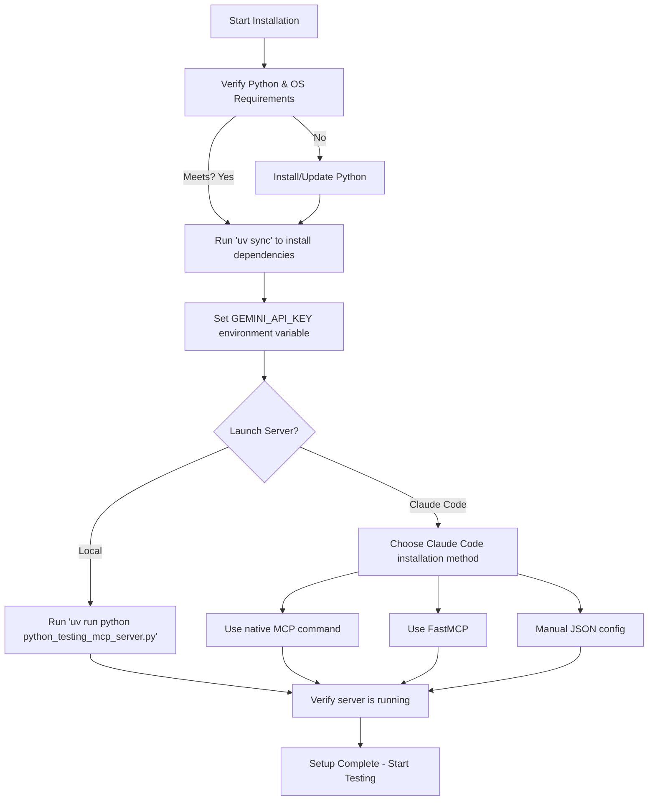

# Installation and Initial Setup

This guide provides a hands-on walkthrough to help you install all necessary dependencies, configure your Gemini API key, and launch the Python Testing Tools MCP Server. Whether you prefer using the terminal or Claude Code environment, this guide ensures you get the MCP server up and running swiftly.

---

## Workflow Overview

### What You'll Achieve
- Install all project dependencies in a reproducible Python virtual environment
- Configure the essential Gemini API key for AI-powered test generation
- Launch the MCP server locally or within Claude Code
- Verify that the server is operational and ready for testing workflows

### Prerequisites
- A supported operating system with Python installed (refer to System Requirements & Prerequisites guide)
- Access to a valid Google Gemini API key
- Basic familiarity with terminal commands or Claude Code commands

### Expected Outcome
By completing this setup, you will have a fully operational Python Testing Tools MCP Server running either locally or integrated with Claude Code. You'll be ready to generate intelligent unit and coverage tests, fuzz test your Python code, and perform mutation testing.

### Time Estimate
Approximately 15-30 minutes depending on network speed and familiarity

### Difficulty Level
Beginner to Intermediate

---

## Step-by-Step Instructions

### 1. Prepare Your Environment

Ensure your system meets requirements (Python version, OS compatibility) and you have your Gemini API key ready.

### 2. Install Project Dependencies

The project uses the `uv` tool to handle virtual environment creation and dependency management.

Open a terminal in your project root directory and run:

```bash
uv sync
```

This command automatically creates a Python virtual environment and installs all dependencies specified in the `pyproject.toml` file.

**Expected Result:** You should see output confirming installation success with no errors.

### 3. Set Your Gemini API Key

The MCP server requires your Gemini API key via the `GEMINI_API_KEY` environment variable.

- On Linux/macOS:

  ```bash
  export GEMINI_API_KEY="your-api-key-here"
  ```

- On Windows (PowerShell):

  ```powershell
  $env:GEMINI_API_KEY="your-api-key-here"
  ```

**Verify your key is set by running:**

```bash
echo $GEMINI_API_KEY
```

It should output your key.

### 4. Launch the MCP Server Locally

Run the MCP server using the `uv` tool:

```bash
uv run python python_testing_mcp_server.py
```

This starts the FastMCP server, which listens for MCP requests.

**Expected Output:** Logs indicating the server has started and is ready.

### 5. Launch the MCP Server in Claude Code (Recommended Methods)

If you use Claude Code, you have three installation options:

#### Method 1: Native MCP Command (Recommended)

1. Enter your project directory:

   ```bash
   cd /path/to/python-testing-mcp
   ```

2. Install dependencies (if not done already):

   ```bash
   uv sync
   ```

3. Add MCP server with environment variable:

   ```bash
   claude mcp add python_testing_tools --env GEMINI_API_KEY=your-api-key-here -- uv run python python_testing_mcp_server.py
   ```

4. Verify connection:

   ```bash
   claude mcp list
   ```

   Look for:

   ```
   python_testing_tools: uv run python python_testing_mcp_server.py - ✓ Connected
   ```

#### Method 2: FastMCP (Alternative)

```bash
uv run fastmcp install python_testing_mcp_server.py --env-var GEMINI_API_KEY=your-api-key-here
```

*Note:* If this fails to detect Claude Code automatically, revert to Method 1.

#### Method 3: Manual JSON Configuration

Edit your `.claude.json` file with the following MCP server entry:

```json
{
  "/path/to/your/project": {
    "mcpServers": {
      "python_testing_tools": {
        "type": "stdio",
        "command": "uv",
        "args": [
          "run",
          "python",
          "/path/to/your/project/python_testing_mcp_server.py"
        ],
        "env": {
          "GEMINI_API_KEY": "your-api-key-here"
        }
      }
    }
  }
}
```

### 6. Verify MCP Server is Running in Claude Code

Start Claude Code:

```bash
claude
```

Then check the MCP server status within Claude Code by typing:

```bash
/mcp
```

You should see a confirmation such as:

```
Reconnected to python_testing_tools
```

This confirms the MCP server is active and connected.

---

## Practical Tips & Best Practices

- Always store your Gemini API key securely; avoid committing it to source control.
- Use the native MCP `claude mcp add` command for easiest integration.
- If dependency installation fails, check your Python and `uv` versions.
- When testing installation, use the provided demo files (e.g., `demo/basic_example_functions.py`) to validate tool functionality.

---

## Quick Test Commands

After successful setup, try these commands to ensure tools respond correctly:

```bash
# Generate unit tests for simple functions
create unit tests for @demo/basic_example_functions.py

# Fuzz test a specific function
fuzz test the add function in @demo/basic_example_functions.py

# Generate coverage tests for advanced algorithms
generate coverage tests for @demo/advanced_algorithms.py

# Run mutation testing on a demo file
run mutation testing on @demo/advanced_algorithms.py
```

Expected behavior: The MCP server processes requests and outputs test code or test reports.

---

## Troubleshooting Common Issues

<AccordionGroup title="Common Setup Issues"> 
<Accordion title="Dependency Installation Fails">If `uv sync` fails:
- Verify your Python version meets requirements.
- Update `uv` to the latest version.
- Check network connectivity and repository availability.
- Review error messages for missing system packages and install them.
</Accordion>

<Accordion title="GEMINI_API_KEY Not Set or Invalid">Ensure you have exported the key in the correct shell environment.
- On terminal restart, confirm the key is still set.
- Review permissions or validity of your Gemini API key.
</Accordion>

<Accordion title="Server Does Not Start or Crashes">Check that no other process is using the same port.
- Review server logs for error messages.
- Confirm all dependencies installed correctly.
- Try running with elevated privileges if permission errors occur.
</Accordion>

<Accordion title="Claude Code Does Not Connect to MCP Server">Verify correct MCP server name and path in your configuration.
- Re-run `claude mcp add` with correct environment variable.
- Restart Claude Code after configuration changes.
- Confirm firewall or antivirus settings aren’t blocking communication.
</Accordion>
</AccordionGroup>

---

## Next Steps & Additional Resources

- Proceed to **[Running Your First Intelligent Python Tests](/guides/getting-started/first-tests)** to start using the tools.
- For detailed server startup instructions, visit **[Starting the Server Guide](/getting-started/first-run-usage-validation/starting-the-server)**.
- Explore **[Configuration & API Key Setup](/getting-started/setup-prerequisites-installation/configuration-setup)** for advanced environment setups.
- If you encounter issues, reference the **[Troubleshooting Common Setup Issues](/getting-started/first-run-usage-validation/troubleshooting)** page.

---

## Summary
This page outlined the essential steps to install dependencies, configure environment variables, and launch the Python Testing Tools MCP Server. You learned how to install via terminal or integrate seamlessly with Claude Code using native commands, FastMCP, or manual JSON configuration.

Start your testing journey now by verifying your installation with demo commands and move forward with creating your first tests using AI-powered tools.

---

## Quick Reference Commands

```bash
# Install dependencies
uv sync

# Export Gemini API key (Linux/macOS)
export GEMINI_API_KEY="your-api-key-here"

# Run server locally
uv run python python_testing_mcp_server.py

# Add MCP server in Claude Code
claude mcp add python_testing_tools --env GEMINI_API_KEY=your-api-key-here -- uv run python python_testing_mcp_server.py

# List MCP servers
claude mcp list

# Start Claude Code
claude

# Check MCP connection
/mcp

# Example test commands
create unit tests for @demo/basic_example_functions.py
fuzz test the add function in @demo/basic_example_functions.py
```

---

## Visual Diagram: Installation Flow



---


---

# End of Installation and Initial Setup Guide
