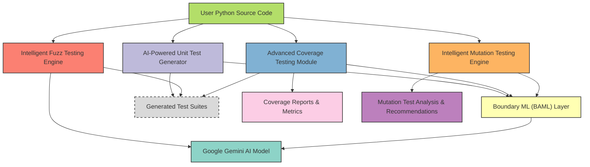

# Core Features at a Glance

Discover the powerhouse tools within the Python Testing Tools MCP Server that revolutionize your Python testing lifecycle. This page presents a succinct yet comprehensive summary of the four core testing tools: AI-powered Unit Test Generation, Intelligent Fuzz Testing, Advanced Coverage Testing, and Intelligent Mutation Testing. Each tool is meticulously designed to resolve pressing developer challenges and deliver measurable improvements in code reliability, test coverage, and efficiency.

---

## Unlock the Power of AI-Driven Python Testing

The MCP Server automates and elevates your testing workflows by harnessing cutting-edge AI models—Google’s Gemini AI combined with Boundary ML (BAML). This synergy creates highly intelligent test artifacts, spanning straightforward unit tests to complex mutation analyses. Whether you aim to generate robust tests automatically, expose elusive bugs through fuzzing, maximize code coverage, or validate test suite effectiveness, these features streamline your entire process.

---

## Four Pillars of Intelligent Python Testing

### 1. AI-Powered Unit Test Generation
Generate comprehensive unit test suites automatically, tailored to your Python files.
- **What it does:** Produces 4 to 6 detailed test cases per function, covering normal behavior, edge conditions, and error handling.
- **Value:** Saves hours of manual test writing, ensuring thorough assertion coverage with minimal effort.
- **Use case:** Instantly get reliable unittest code that fits your project structure, including imports and formatting.

### 2. Intelligent Fuzz Testing
Stress-test your functions with smartly generated inputs that challenge boundaries and error detection.
- **What it does:** Creates 20+ diverse, AI-generated inputs including malformed, boundary, and large data sets.
- **Value:** Reveals hidden defects, crashes, and vulnerabilities before they reach production.
- **Use case:** Target specific functions to uncover robustness issues with exhaustive, edge-driven fuzz inputs.

### 3. Advanced Coverage Testing
Achieve near-complete line and branch coverage with AI-guided test cases designed for your code’s unique paths.
- **What it does:** Analyzes your Python AST to detect branches, loops, exception paths, and returns; generates targeted tests to cover every detected scenario.
- **Value:** guarantees maximum code path coverage, improving code quality and reducing blind spots.
- **Use case:** Integrate coverage-focused tests that include complex loops, conditionals, try/except blocks, and special cases like infinity or NaN.

### 4. Intelligent Mutation Testing
Evaluate and strengthen your existing test suites by simulating code mutations and analyzing test effectiveness.
- **What it does:** Applies smart AST-based mutations (e.g., operator flips, condition negations), runs tests against mutated code, and leverages AI to analyze uncovered gaps.
- **Value:** Delivers a mutation score quantifying test quality, with AI-driven recommendations to fill testing gaps.
- **Use case:** Assess and improve test robustness, even when no current tests exist, with actionable insights.

---

## How These Tools Transform Your Workflow

| Feature                    | Developer Pain Point Addressed                            | Measurable Benefits                          |
|----------------------------|-----------------------------------------------------------|----------------------------------------------|
| Unit Test Generation       | Time-consuming manual test authored with limited variants | Accelerates test creation, ensures thorough coverage |
| Intelligent Fuzz Testing   | Difficulty in crafting diverse failure-inducing inputs    | Detects bugs and edge cases automatically     |
| Advanced Coverage Testing  | Incomplete path coverage and blind spots                  | Maximizes test coverage, improves confidence |
| Intelligent Mutation Testing | Uncertainty about test effectiveness and silent failures | Identifies test weaknesses, improves mutation scores |

---

## Real-World Scenario: From Code to Confidence

Imagine working on a complex Python module with multiple branches and error handling. Manually writing tests to cover all paths and edge cases is daunting. With the MCP Server:

1. Run AI-powered Unit Test Generation to create robust initial tests.
2. Use Intelligent Fuzz Testing to inject challenging inputs that expose hidden faults.
3. Execute Advanced Coverage Testing to fill coverage gaps, especially in tricky loops and exceptions.
4. Apply Intelligent Mutation Testing to evaluate the test suite and receive focused improvement suggestions.

Your project achieves thorough validation with a fraction of the effort, mitigating risk, and boosting developer productivity.

---

## Summary of Key Features

- **AI-Powered Unit Test Generation:** Automatic creation of unittest suites covering normal, edge, and error cases with correct formatting and imports.
- **Intelligent Fuzz Testing:** AI-driven creation of diverse inputs for robust fuzz testing including malformed and boundary cases.
- **Advanced Coverage Testing:** AST based detection of control paths with AI-generated targeted tests for maximum line and branch coverage.
- **Intelligent Mutation Testing:** AST-based code mutation engine that assesses test quality and provides AI-powered analysis and actionable gap recommendations.
- **Unified AI Engine:** Combines BAML’s structured response ability with Gemini AI’s language understanding for reliable, precise test outputs.

---

## Practical Tips & Best Practices

- Start with **Unit Test Generation** to lay down the foundation of your test suite.
- Follow up with **Fuzz Testing** for targeted functions handling critical or complex inputs.
- Use **Coverage Testing** routinely to ensure new code additions are fully tested.
- Schedule **Mutation Testing** runs to continuously gauge test suite health and maintain effectiveness.
- Complement automated tests with manual reviews, especially for critical logic or security-sensitive code.

---

## Getting Your Hands Dirty: Quick Start Preview

To experience these tools:

```bash
# Generate unit tests for a Python file
uv run python -c "from tools.unit_test_generator import generate_unit_tests; print(generate_unit_tests('demo/basic_example_functions.py'))"

# Fuzz test a specific function
uv run python -c "from tools.fuzz_tester import fuzz_test_function; print(fuzz_test_function('demo/basic_example_functions.py', 'add'))"

# Generate coverage-driven tests for a module
uv run python -c "from tools.coverage_tester import generate_coverage_tests; print(generate_coverage_tests('demo/advanced_algorithms.py'))"

# Run mutation testing and analyze results
uv run python -c "from tools.mutation_tester import run_mutation_testing; print(run_mutation_testing('demo/advanced_algorithms.py'))"
```

Make sure you have your environment configured with the necessary `GEMINI_API_KEY` as described in the [Configuration & API Key Setup](../getting-started/setup-prerequisites-installation/configuration-setup) page.

---

## Troubleshooting Common Challenges

<AccordionGroup title="Common Issues Using Core Features">
<Accordion title="Unit Test Generation Produces Incomplete Tests">
  - Verify that the source file is valid Python code without syntax errors.
  - Confirm your Gemini API key is set and has sufficient quota.
  - Try running on simpler demo scripts first to isolate issues.
</Accordion>
<Accordion title="Fuzz Testing Misses Edge Cases">
  - Check that the targeted function is correctly named and exists in the file.
  - Increase fuzz input count or complexity if default inputs aren’t penetrating logic.
  - Review AI response logs for insights into input generation.
</Accordion>
<Accordion title="Coverage Reports Show Low Coverage After Testing">
  - Ensure your existing tests are being correctly detected and executed.
  - Validate that paths and imports in tests align properly with code under test.
  - Use detailed coverage reports to identify blind spots for manual testing.
</Accordion>
<Accordion title="Mutation Testing Fails to Run or Analyze">
  - Confirm backup and restore permissions for source files are correct.
  - Check test discovery paths and naming conventions.
  - Review mutation engine logs for any unexpected exceptions.
</Accordion>
</AccordionGroup>

---

By leveraging the MCP Server's intelligent core features summarized here, your testing becomes more automated, intelligent, and insightful — directly addressing even the most intricate challenges in Python testing.

---

_For more detailed information, explore individual feature guides and tools in the documentation._


---

### Related Documentation Links

- [Product Introduction & Value Proposition](/overview/product-intro-and-architecture/product-value-proposition)
- [System Architecture & Main Components](/overview/product-intro-and-architecture/core-architecture-overview)
- [Automating Python Unit Test Generation](/guides/core-workflows/guide-unit-testing)
- [Fuzz Testing Functions with AI-Generated Inputs](/guides/core-workflows/guide-fuzz-testing)
- [Generating Comprehensive Coverage-Driven Test Suites](/guides/core-workflows/guide-coverage-testing)
- [Applying Mutation Testing for Test Quality Analysis](/guides/core-workflows/guide-mutation-testing)
- [Configuration & API Key Setup](/getting-started/setup-prerequisites-installation/configuration-setup)


---

### Visual Overview


