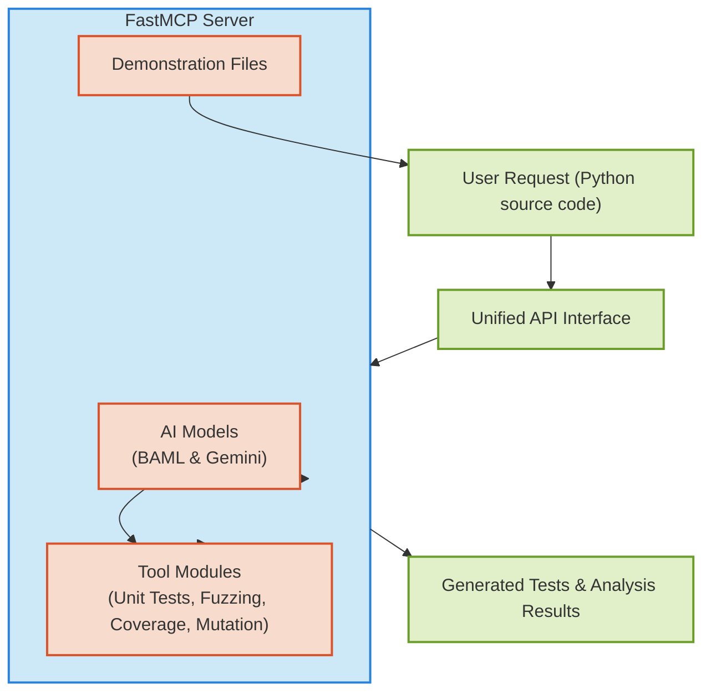

# System Architecture & Main Components

Explore the core building blocks of the Python Testing Tools MCP Server — from the FastMCP server and AI integration layers to modular testing tools and demonstration files. This page walks you through how user requests flow through the system, how various test generation and analysis capabilities are orchestrated behind a unified interface, and how the different components interconnect to deliver efficient AI-powered Python testing automation.

---

## Why This Matters

Understanding the system architecture empowers you to leverage the Python Testing Tools MCP Server effectively. Knowing how individual components operate and relate gives clarity on how your source code requests are processed, how AI-driven models integrate, and how test artifacts, such as unit tests or mutation analyses, are generated seamlessly.

This page demystifies how core modules collaborate to provide test automation features, simplifying integration and customization for your Python development workflows.

---

## Core Components Overview

The system consists of several key parts working cohesively:

- **FastMCP Server:** The central runtime environment handling API calls, dispatching requests across AI models, and managing test generation workflows.
- **AI Integration Layers:** These layers bring together two distinct AI models, BAML and Gemini, strategically applied for generating various test types such as unit tests, fuzz inputs, coverage tests, and mutation testing analysis.
- **Tool Modules:** Dedicated components that encapsulate specific testing capabilities — for example, modules focused on fuzz testing, coverage analysis, or mutation testing recommendations.
- **Demonstration Files:** Sample Python code and related testing files that illustrate how to utilize generated tests, serving as practical templates.

By orchestrating these modules, the system offers an intuitive yet powerful interface for AI-driven Python test creation.

---

## How Requests Flow Through the System

1. **Client Request Initiation:** When you submit Python source code for testing, the FastMCP server receives this request.

2. **Routing to AI Models:** The system parses the request context and uses the BAML and Gemini AI models to generate the requested tests or analyses. BAML operates as the primary model orchestrating detailed code insights, while Gemini complements with specialized capabilities.

3. **Test Generation & Analysis:** Depending on the request type, relevant tool modules execute:
   - **Unit Test Generation:** Creating structured, executable Python test cases.
   - **Fuzz Input Generation:** Producing diverse, randomized data inputs to stress-test code.
   - **Coverage Tests:** Identifying and crafting tests to cover unexplored code paths.
   - **Mutation Analysis:** Assessing test suite effectiveness by simulating code mutations and generating improvement recommendations.

4. **Response Construction:** The generated test artifacts are bundled and returned via a unified API interface.

---

## Unified Interface for Diverse Testing Capabilities

Despite the variety of testing tasks, the system presents a consistent interaction model. Whether you want to produce fuzz inputs or analyze mutation survivors, the interface abstracts underlying complexities, so you focus on the testing goals rather than implementation details.

This uniformity accelerates your workflow:

- Submit your code once.
- Select the testing capability.
- Retrieve actionable test files or reports without extra overhead.

---

## Visualizing the Architecture

---

## Key Benefits From This Architecture

- **Seamless Integration:** A single API interface masks the complexity of multi-model AI processing and diverse test modules.
- **Extensibility:** Modular design enables onboarding new AI models or testing capabilities with minimal disruption.
- **Efficiency:** Dedicated AI layers and tool modules ensure specialized tasks are optimized for high-quality output.
- **Consistency:** Uniform request and response patterns streamline client-side interaction and automation.

---

## Practical Example: Generating Coverage Tests

Imagine you want to generate coverage tests for a Python function:

1. You submit your Python source code file via the API interface on the FastMCP server.
2. The server routes your request to the BAML and Gemini AI models.
3. These models collaborate within the tool modules dedicated to coverage analysis.
4. The tool modules produce a Python test suite covering all edge cases.
5. The generated test suite is returned to you seamlessly through the unified API.

No need to manually run separate models or combine results — the system handles all orchestration.

---

## Tips for Success

- **Prepare source code inputs carefully:** Clear and complete input code yields better AI-generated tests.
- **Choose appropriate testing capability:** Leverage specific tool modules depending on your goals — e.g., fuzz inputs for robustness, mutation analysis for test quality.
- **Monitor returned test files:** Review generated test cases and mutation reports to fine-tune your testing strategy.

---

## Next Steps

- Head over to the [Product Introduction & Value Proposition](/overview/product-intro-and-architecture/product-value-proposition) page to understand the full product scope beyond architecture.
- Explore detailed [Core Features](/overview/concepts-features-usecases/core-features-overview) to see how capabilities translate into actionable workflows.
- Start with [Installation Steps](/getting-started/setup-prerequisites-installation/installation-steps) if you're ready to deploy.

---

This architecture overview empowers you to visualize and leverage the powerful AI-driven testing automation within the Python Testing Tools MCP Server, setting a strong foundation for effective testing and quality assurance.
